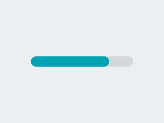

# Progress Bar
**obj:`bar`**

| Property | Value      | Default | Description
|----------|------------|---------|---------------
| min      | [int16][9]      | 0       | minimum value of the indicator
| max      | [int16][9]      | 100     | maximum value of the indicator
| val      | [int16][9]      | 0       | current value of the indicator
| start_value | [int16][9]   | 0       | optional minimal allowed value of the indicator

Vertical bars can be created if the width of the object is smaller than its height.

!!! note
    `min`, `max`, `val` and `start_value` also support negative values.
   
[1]: ../../data-types/#colors
[2]: ../../data-types/#boolean
[3]: ../../../configuration/gpio/#groupid
[4]: ../../styling/#general
[5]: ../../styling/#image
[6]: ../../styling/#value
[7]: ../../styling/#line
[8]: ../../styling/#scale
[9]: ../../data-types/#integer
[10]: ../../data-types/#string
[11]: ../../data-types/#json-object
[12]: ../../styling/
[13]: ../../styling/#padding-and-margin
[14]: ../../styling/#text
[15]: ../../data-types/#variables
[16]: https://lvgl.io/tools/imageconverter
[17]: ../../../integrations/home-assistant/sampl_conf/#using-tags
[18]: ../../styling/#parts
