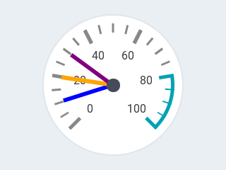

# Gauge
**obj:`gauge`**



| Property       | Value      | Default | Description
|----------------|------------|---------|---------------
| min            | [int16][9]      | 0       | minimum value of the indicator
| max            | [int16][9]      | 100     | maximum value of the indicator
| val            | [int16][9]      | 0       | current value of the indicator
| critical_value | [int16][9]      | 80      | scale color will be changed to scale_end_color after this value
| label_count    | [uint8][9]      |         | number of labels (and major ticks) of the scale
| line_count     | [uint16][9]     | 31      | number of minor ticks of the entire scale
| angle          | 0-360      | 240     | angle between start and end of the scale
| rotation       | 0-360      | 0       | offset for the gauge's angles to rotate it
| format         | [uint16][9]     | 0       | divider for major tick values

To strip trailing zero's of major tick labels the `format` divider can be used to scale the values before printing:

- `0` : print the major tick value as is
- `1` : strip 1 zero, i.e. divide tick value by 10 before printing the major tick label
- `2` : strip 2 zeros, i.e. divide tick value by 100 before printing the major tick label
- `3` : strip 3 zeros, i.e. divide tick value by 1000 before printing the major tick label
- `4` : strip 4 zeros, i.e. divide tick value by 10000 before printing the major tick label

Only these values are allowed, arbitrary numbers are not supported.

!!! note
    `min`, `max` and `val` also support negative values.
   
???+ example "Example `jsonl`"
    ```json linenums="1"
    {"page":1,"id":13,"obj":"gauge","x":20,"y":70,"w":200,"h":200}
    ```

Use [scale][8] properties to customize.
   
[1]: ../../data-types/#colors
[2]: ../../data-types/#boolean
[3]: ../../../configuration/gpio/#groupid
[4]: ../../styling/#general
[5]: ../../styling/#image
[6]: ../../styling/#value
[7]: ../../styling/#line
[8]: ../../styling/#scale
[9]: ../../data-types/#integer
[10]: ../../data-types/#string
[11]: ../../data-types/#json-object
[12]: ../../styling/
[13]: ../../styling/#padding-and-margin
[14]: ../../styling/#text
[15]: ../../data-types/#variables
[16]: https://lvgl.io/tools/imageconverter
[17]: ../../../integrations/home-assistant/sampl_conf/#using-tags
[18]: ../../styling/#parts
