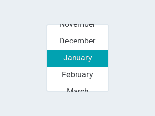

# Roller
**obj:`roller`**



| Property | Value      | Default | Description
|----------|------------|---------|--------------------------
| options  | [string][10]     | ""      | List of items separated by `\n`
| val      | [int16][9]      | 0       | The number of the selected item
| text     | [string][10]     | ""      | *Read-only* The text of the selected item
| rows     | [int8][9]       | 3       | The number of rows that are visible<BR>Use this property instead of `h` to set object height
| mode     | 0..1       | 0       | Roller mode: `0` = normal (finite), `1` = infinite
| align    | [string][10]       | `center`       | Text alignment: `left`, `center`, `right` 

To change the currently selected item, use the `val` attribute.    
To change the items in the list, use the `options` attribute.

???+ example "Example `jsonl`"
    ```json linenums="1"
    {"page":1,"id":11,"obj":"roller","x":125,"y":205,"w":105,"h":30,"options":"Apple\nBanana\nOrange\nMelon","mode":1}
    ```

When the item is changed both `val` and `text` of the newly selected item are send out accompanied by the `change` event.
   
[1]: ../data-types.md#colors
[2]: ../data-types.md#boolean
[3]: ../../firmware/configuration/gpio.md#groupid
[4]: ../styling.md#general
[5]: ../styling.md#image
[6]: ../styling.md#value
[7]: ../styling.md#line
[8]: ../styling.md#scale
[9]: ../data-types.md#integer
[10]: ../data-types.md#string
[11]: ../data-types.md#json-object
[12]: ../styling.md
[13]: ../styling.md#padding-and-margin
[14]: ../styling.md#text
[15]: ../data-types.md#variables
[16]: https://lvgl.io/tools/imageconverter
[17]: ../../integrations/home-assistant/sampl_conf.md#using-tags
[18]: ../styling.md#parts
