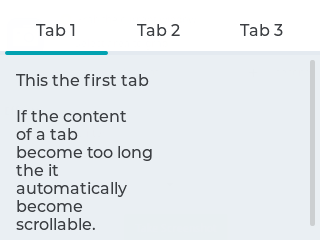

# Tabs

## Tabview
**obj:`tabview`**



A tabview is an object that can hold multiple tab objects.
You first create the `tabview` object and then add `tab` objects to it.

| Property | Value        | Default | Description
|----------|--------------|---------|--------------------------
| val      | [int8][9]    | 0       | The number of the active tab, starting at 0
| text     | [string][10] | ""      | The name of the active tab
| btn_pos  | 0..4         | 1       | Position of the tab buttons:</br>`0` = none</br>`1` = top</br>`2` = bottom</br>`3` = left</br>`4` = right
| count    | [uint16][9]  | 0       | *Read-only* The number of tabs of the tabview

To change the currently visible tab, use the `val` attribute after all tabs have been added.   

!!! note
    To adjust the height of the tab buttons row, use `pad_top40` and `pad_bottom40` [styling][13] properties. Accepts also negative values.     
    To adjust the text size of the tab names, use the `text_font40` [styling][14] property.    

Read further down to learn now to add tabs to the tabview.


## Tab
**obj:`tab`**

| Property | Value        | Default | Description
|----------|--------------|---------|--------------------------
| parentid | [int8][9]    | 0       | The `id` of the tabview object to which this tab is added
| text     | [string][10] | "Tab"   | The name of tab button

Set the parent object (which `tabview` the tabs belong to) by referencing the `parentid` when creating the tab.
To add other objects to these tabs, set the `parentid` when creating those objects to the _id of the tab_ you wamt them to appear on.

???+ example "Example `jsonl`"
    ```json linenums="1"
    {"page":1,"id":14,"obj":"tabview","btn_pos":1,"y":180}
    {"page":1,"id":51,"obj":"tab","parentid":14,"text":"Tab 1"}
    {"page":1,"id":52,"obj":"tab","parentid":14,"text":"Tab 2"}
    {"page":1,"id":53,"obj":"tab","parentid":14,"text":"Tab 3"}
    {"page":1,"id":61,"obj":"switch","x":20,"y":10,"w":60,"h":30,"parentid":51,"radius":25,"radius20":25}
    {"page":1,"id":71,"obj":"dropdown","x":15,"y":10,"w":110,"h":30,"parentid":52,"options":"Apple\nBanana\nOrange\nMelon"}
    {"page":1,"id":81,"obj":"checkbox","x":15,"y":10,"w":110,"h":30,"parentid":53,"text":" Nice tabview"} 
    ```
   
[1]: ../../data-types/#colors
[2]: ../../data-types/#boolean
[3]: ../../../configuration/gpio/#groupid
[4]: ../../styling/#general
[5]: ../../styling/#image
[6]: ../../styling/#value
[7]: ../../styling/#line
[8]: ../../styling/#scale
[9]: ../../data-types/#integer
[10]: ../../data-types/#string
[11]: ../../data-types/#json-object
[12]: ../../styling/
[13]: ../../styling/#padding-and-margin
[14]: ../../styling/#text
[15]: ../../data-types/#variables
[16]: https://lvgl.io/tools/imageconverter
[17]: ../../../integrations/home-assistant/sampl_conf/#using-tags
[18]: ../../styling/#parts
